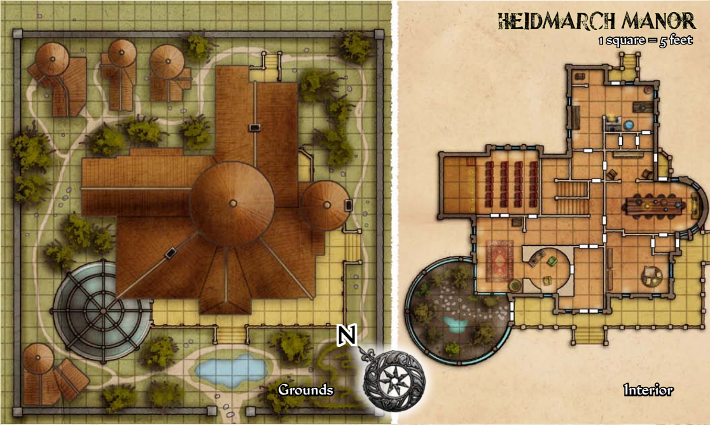

破碎魔星冒险历程即将展开，勇敢的英雄们需要寻找分散在各处的古代魔法遗物碎片，以拯救瓦瑞西亚大陆免于灾难。玩家角色能否成功重铸破碎魔星，还是失落帝国的阴影将再次笼罩世界？

本指南中的选项有助于将角色与探险者协会和马格尼马市联系起来。无论玩家角色以何种方式前往瓦瑞西亚，这个冒险历程都将角色的基地设定为马格尼马市，具体来说是海德玛奇庄园。想了解瓦瑞西亚的详细情况，请参阅《探险者指南：瓦瑞西亚，传奇诞生之地》以及《符文领主的崛起玩家指南》，其中包括瓦瑞西亚的对玩家友好的介绍。

以下考虑事项和战役背景是为破碎魔星冒险历程量身定制的。这些提示、建议和角色选项旨在帮助玩家创建适合立即投入行动并在这场致命战役中表现出色的角色。

## 角色提示

你即将开始一场史诗般的冒险——但你应该如何准备呢？以下是在设计破碎魔星冒险历程的角色时需要注意的几个事项。

**探险者协会成员**：此冒险历程假定玩家角色是探险者协会的成员。除了以下战役背景外，资源如《探险者设定集：探险者协会实地指南》和《探险者设定集：秘密的追寻者》也可以帮助你丰富角色背景。

**废墟探险者**：这个战役将带你穿越多个古代地牢。知识（历史）和种族的昏暗视觉或黑暗视觉可能会派上用场。依赖动物伙伴或坐骑的职业可能会发现大型生物在狭窄的地下通道中是个累赘。如果你选择玩这种职业，可以考虑一个用其他能力取代动物伙伴的变体，或者选择一个小型种族，其中型坐骑在这种条件下表现更好。尽管如此，破碎魔星绝不仅仅是地牢探险战役——还会有大量的旅行和城市及沼泽环境的探索。

**无情的对手**：破碎魔星冒险历程中包含了大量经典怪物，所以要做好应对一切的准备！你将面对许多不同种类的生物——从低级别的虫类、人型生物和妖精，到高级别的巨人、不死生物、构装体、异怪和邪恶异界生物。

**精神续作**：本战役发生在瓦瑞西亚其他冒险历程之后。然而，破碎魔星中访问的地点几乎都是探险者历程中尚未探索的区域，因此要准备好迎接新的面孔、敌人和战斗，而不是重复的内容！

**瑟西隆**：古老的瑟西隆是这个战役的重要元素，因此一个对研究感兴趣的角色（或研究瑟西隆魔法的角色，见《探险者设定集：内海魔法》第17页）可能会特别有趣。

## 战役背景

以下战役背景将角色与破碎魔星冒险历程联系起来。为此战役设计的角色应该计划成为马格尼马市的居民或新来者。他们还应是探险者协会的成员，或者是对加入当地探险者协会分会感兴趣的非成员。

**大理石弃民**：你曾是马格尼马最富有家庭之一的成员……或者曾经是。一次争吵让你被逐出家门并被剥夺继承权。现在你希望离开这座城市，找到足够的财富以羞辱你以前的亲人——这些目标让你加入了探险者协会。尽管被流放，你的名字在马格尼马仍然有相当的影响力，在城市内进行的交涉和威吓检定时，你获得+1背景加值。此外，你开始游戏时拥有一套贵族服饰、一枚印戒和一件价值不超过200金币的非魔法物品。你的姓氏可能是德雷西、卡德伦、敏杜瑞安、尼罗登、斯卡内蒂、瓦尔德玛、范德雷尔或维萨德（也可以是你选择的其他姓氏，参见《探险者设定集：马格尼马，纪念碑之城》）。

**前斯卡尔尼帮成员**：虽然你是作为马格尼马的一个斯卡尔尼帮派成员长大的，但你从未融入你那些定居的大都市同胞中。探险者协会特别看中了你的流浪癖和潜力，多次被你的街头智慧和技巧所打动或愚弄。多年来，你与斯卡尔尼帮渐行渐远，最终离开去追求简单强盗行为之外的兴趣，尽管你仍记得你的犯罪亲戚教给你的那些课程。你在传递隐藏信息的唬骗检定上获得+2背景加值。此外，任何时候你执行致命一击时，你会额外造成1d6点伤害。

**交流代理**：虽然你是马格尼马的相对新人，但你并不是天真的陌生人。你被你家乡的探险者协会分会派遣来了解瓦瑞西亚，通过亲身体验边疆生活。抵达后，你向马格尼马分会报告，并将你的专业知识置于冒险队长的处置之下。为了代表你在遥远土地上的经验，选择一个瓦瑞西亚以外的国家作为你的家乡，并获得该国的一种语言作为奖励语言（参见《探险者设定集：内海世界指南》）。此外，选择以下技能之一：驯养动物、知识（地理）、语言学或生存。你在该技能的检定中获得+1背景加值，并且该技能始终是你的本职技能。

**纪念碑学者**：在马格尼马的童年时期，这座城市的古代纪念碑让你充满了奇迹般的感动。多年来，你对这些遗迹的迷恋与日俱增，促使你加入探险者协会以进一步满足你的求知欲。虽然你对这些纪念碑的实际知识知之甚少，但你已经对这些巨大的作品进行了广泛的研究，深入了解了这座城市的一些最著名的地标。由于你熟悉瓦瑞西亚的历史遗迹，你在瓦瑞西亚进行的知识（历史）检定中获得+1背景加值。如果检定与马格尼马市相关，这个加值增加到+2。此外，你在进行任何技能检定以从马格尼马的魔法纪念碑中获得益处时，获得+2背景加值（详细信息参见《马格尼马，纪念碑之城》）。

**非传统本地人**：你是休盎提或瓦瑞西亚民族的一员，为了了解你的奇异家乡的秘密而离开了你的族人。你的旅行最近把你带到了马格尼马的探险者协会分会。虽然你的家人不在身边，但你带着他们和你的家庭传统。  
如果你是瓦瑞西亚人，你在进行与瓦瑞西亚相关的知识（地理）检定时获得+1背景加值，并且突袭轮中在你使用刃巾或星刃进行的伤害检定时获得+1背景加值。  
如果你是休盎提人，你在瓦瑞西亚进行生存检定时获得+1背景加值，并且在使用裂地锤或喀拉尔进行的重击确认检定时获得+1背景加值。

**废墟掠夺者**：尽管马格尼马的商业产业吸引了你对金钱收益的敏锐眼光，你知道，真正财富的大胆路线在于追踪稀有遗物并将其卖给出价最高者。成为一名探险者似乎是显而易见的决定，让你可以在瓦瑞西亚各地旅行寻找财富，因此你立刻报名参加。你带来了敏锐的眼力和辨别真假物品的能力。你在估价检定上获得+1背景加值。此外，你在进行感知检定以区分类雕像生物（如柱状女像柱和石像鬼）与实际雕像时，获得+4加值。

**蛇跑竞技者**：你曾参加过蛇跑，马格尼马的宏伟赛马场，进行模拟角斗士战斗和竞技项目，但这些游戏的安全性让你感到无聊。为了寻求更大的刺激和能力的考验，你将你的武器和技能奉献给了当地的探险者协会分会。选择以下收益之一，以代表你在蛇跑期间学到的技巧：选择一种特定类型的盔甲。当穿戴这种类型的盔甲时，你将其盔甲检定减值视为低1。使用双武器战斗时，你的主手武器减值减少1。你在使用威吓检定打击士气时获得+2背景加值。

## 探险者协会背景

以下背景非常适合开始碎星冒险历程的探险者。这些背景最早出现在《探险者设定集：派系指南》中。

**协会之兽**（魔法）：协会的德鲁伊前辈为你揭示了将你的形态改变为野兽的秘密。每当你使用你的自然变身能力将自己变形为一个小型或中型的动物，你的变形效果持续每德鲁伊等级2小时，而非原来的1小时。

**协会狂暴者**（战斗）：你在探索者协会所经历的时间教会了你关于狂暴能力源泉的新知识。你每天可以额外使用3轮狂暴能力。

**协会之刃**（战斗）：协会为你提供了数百种类人生物与怪物的弱点知识。你偷袭造成的伤害获得+1背景加值。

**协会守卫者**（战斗）：你在探索者协会伟大的战士们学习，这段时间教会了你穿戴护甲时新的防御技巧。穿戴中甲或重甲时你的AC获得+1背景加值。

**协会颂教者**（信念）：艾巴萨罗姆中的探索者本部的地下室里收藏了许多关于神祉的神圣力量的秘密，而你大量地学习了其中你所信仰的神祉的那部分。你每天引导能量次数额外加1。

**协会大法师**（魔法）：在探险者协会最伟大的施法者指导下进行数月的冥想和练习，使你增加了对奥术知识的掌握能力。你获得一个额外的0环法术位。

**协会炮台**（魔法）：通过花费大量时间在协会浩瀚的藏书中学习奥术的知识，你学会了如何对你的敌人造成更多的伤害。当你施放一个造成伤害的法术时，你的法术总伤害获得+1背景加值。无论你施放的法术造成何种类型的伤害，该额外伤害总是力场伤害。

**协会拳尊**（战斗）：你研读过数十卷协会内独有的武术古卷，且你对这些武术的修习比大多数人都更深。你的气池增加一点。

**协会音乐家**（社会）：得益于艾巴萨罗姆探索者协会本部地下室大量的珍贵乐谱，格拉里昂众多伟大音乐家的技巧如今在你的指尖跃动。你在协会学到的音乐知识令你每天的吟游表演轮数增加3轮。

**协会无畏者**（信念）：协会珍藏的英雄史诗中记载的古代圣武士信条给予你英勇无畏的力量。你的勇气灵光职业能力额外在对抗恐惧的豁免上提供+1背景加值。

**协会追踪者**（战斗）：你的探索者生涯让你成为追踪艺术的大师。当你处于任何一种你的偏好地形时，你的先攻检定获得+1背景加值，生存检定获得+2背景加值。这些加值与任何你从你的偏好地形职业能力获得的加值叠加。

# 马格尼马一瞥

建立在古代石碑的阴影之下，马格尼马不断努力超越散布在瓦瑞西亚风景中的古老奇迹的压倒性规模和壮丽。这个城市充满了巨大的机遇、社会压力和冷酷的美丽，散发着南方大都市的氛围，力求超越其不光彩的起源，从科尔瓦萨的流亡者避难所崛起为文化和自由的灯塔，矗立在这片无情之地上。然而，它的高耸纪念碑、优雅花园、炫耀的建筑和精致的雕塑只是覆盖在一个挣扎的政府和急需英雄的绝望人民之上的一层破裂面具。

马格尼马的创始人是冒险家，冒险家和探险家的精神使马格尼马的心灵得以生存。因此，这座城市以探险主题的纪念碑闻名于世并不足为奇。此外，多年来许多主要作品都被赋予了魔法力量。关于这些增强效果的来源有很多争论，一些人认为它们是已故或匿名的法师为城市的馈赠，而另一些人则怀疑这些魔法效果实际上代表了古老的瑟西隆巫术在该地区的遗留。事实上，这些效果是Seacleft地区神秘保护者的显现，这些古老的天国领主在过去几千年里受到瓦瑞西亚本土人民的深爱和崇敬。这些领主欢迎土地上的新定居者，尽管他们的欢迎是微妙的。

在马格尼马的许多纪念碑中，对那些向马格尼马、它的纪念碑以及守护城市的天国领主表达崇敬和尊重的人们，会被赐予祝福。任何一个非邪恶的智慧生物，在一座被魔法充能的纪念碑前执行特定行为并成功进行技能检定，会唤醒纪念碑的魔法力量，并作为回报获得一个持续24小时的小型奖励。一个人在同一时间内只能享受一个由纪念碑赐予的奖励；在第一个奖励效果未消失之前尝试获取第二个奖励会自动失败。此外，一个人每周尝试从纪念碑奖励中获益的次数不超过她的魅力调整值（最少一次每周）——毕竟，马格尼马更常回应那些表现出更大镇定和个性的人。

马格尼马拥有超过16,000名居民，其中绝大多数是人类。大部分人是切利亚斯人和瓦瑞西亚人，尽管休盎提人和斯科扎尼人在城市中占据重要位置，但他们基本上被边缘化并被视为麻烦制造者。半身人是第二大人口群体，其次是精灵和矮人。其余的人口包括侏儒和混血种族。

城市被一座巨大的悬崖分为两半，形成两个主要区域。悬崖顶部的区域称为峰顶（Summit），而与瓦瑞西亚湾相接触的下部区域称为海岸（Shore）。马格尼马的贫民窟被称为影子（Shadow），因为那个区域在白天几乎见不到阳光，它位于Irespan之下，这是一座废弃已久的巨大古桥。在魔法物品的交易和购买方面，马格尼马有一个基础价值为12,800 gp，购买限额为75,000 gp。

Heidmarch庄园是探险者协会的一个基地，也是冒险者在这个冒险路线中的家。它位于峰顶的Alabaster区。城市的其他区域也提供了可能会引起冒险者兴趣的地点。帆之集市（Bazaar of Sails）是瓦瑞西亚最大的自由市场，位于Dockway，还有Old Fang，一个流行的酒吧。纪念碑之城（City of Monuments，也就是马格尼马）内可以找到各种不同信仰的神殿。例如，卡丽丝翠的神殿，Dome of the Savored Sting位于Keystone区；此区还设有法拉斯玛教堂，负责处理城市的死者和新生儿。此外，还有埃拉斯蒂尔教堂Deadeye Lodge和奉献给黛丝娜的Cynosure Tower。在峰顶的Naos区内则有艾奥梅黛教堂，以及几个街区外的阿巴达尔大教堂。在Keystone区学习奥术魔法的人可能会对Stone of the Seers感兴趣，这是一所专注于教授防护和预言魔法的学校。

在悬崖边上俯瞰瓦瑞西亚湾，许多人会去Serpent's Run寻找娱乐，这是一个巨大的马场，提供各种激动人心的活动，如十项全能比赛、马和狗赛、魔法表演、马戏团表演和模拟剑斗。在Capital区的对岸，Naos区的Arvensoar耸立，是马格尼马军队的据点。

在Yondabakari河的对岸是Ordellia，也称为外国区。那些寻找药水和其他炼金产品的人经常会去Billivin's Benevolent Balms and Effulgent Elixirs，尽管有人怀疑他的产品的可靠性。

## Heidmarch庄园

Heidmarch庄园是马格尼马市两位最古怪的公民的住所：享有盛誉的猎人、探险家和探险者协会成员Sheila Heidmarch（LN女性塔尔多人战士3/武僧4）及其丈夫Sir Canayven Heidmarch（NG男性塔尔多人游侠8）。这对环球旅行的冒险家已经在马格尼马退休，但并未安于平静的生活，而是将他们宽敞的庄园开放给探险者协会。作为瓦瑞西亚地区第一个探险者协会分会，他们欢迎所有渴望探索这片相对未知的土地的成员，包括周边地区和神秘的纪念碑之城本身。探险者协会的访客们在庄园里享受舒适的住宿、丰富的远古传说图书馆和主人们的睿智建议。

# 关于探险者协会

探险者协会已存在400多年。成员包括寻宝者、探险家、盗墓者、历史学家和流浪者，他们漫游世界的最边远地区，寻找失落的遗物和答案，探索世界上最神秘和危险的谜题。这些英雄们勇敢地穿越长满藤蔓的丛林废墟，攀登积雪覆盖的山峰，穿越被阳光晒焦的沙漠沙丘，寻找埋藏的古墓和昔日时代的纪念碑。

协会成员将他们的事迹记录发送给他们的冒险队长上级，后者会审核其准确性，然后将手稿转交给探险者协会的领导者。其中最激动人心和启发性的事迹有可能被印刷并作为著名的探险者协会编年史的卷册进行分发。

尽管探险者协会本身不关心个别探险者协会成员的具体行动，但他们要求这些成员及其行动符合探索、报告和合作的一般准则。被认为无法遵循这些简单规则的探险者协会将被开除出协会。

大多数探险者协会在艾巴萨罗姆的大本营接受必要的技能培训，但一些经验丰富的冒险家在证明自己能力后被授予协会的外勤委任。参与《破碎魔星》冒险者之路的大多数探险者协会可能就是这种情况。

协会由十位蒙面和秘密的成员——十人会——指导，他们的身份甚至对彼此都是保密的。每位十人会成员担任职位的时间不为人知；同样，他们存在的每一个方面，从提名到选举，从会议到正式公共功能，从日常功能到退休，都是完全神秘的。十人会的身份是协会最严密保守的秘密之一，有人说，十人会为了保护这个秘密愿意诉诸杀人。

探险者协会总部设在艾巴萨罗姆宏大的大厦，但整个组织在内海地区和葛拉利昂各地拥有许多官方旅馆和据点。

## 协会的目标：探索，报告和合作

协会没有正式的章程，但所有成员都被期望遵守一般行为准则，违反该准则的行为会导致被开除出协会。成员的三个重要职责如下：

**探索**：探险者协会成员被期望通过前往遥远的地方、揭示禁忌的秘密以及拼凑世界的秘密历史来推广协会的知识和声誉。成员们被鼓励在未知的土地上寻找更加奇幻的神秘。

**报告**：在冒险过程中，探险者协会成员被期望详细记录他们的经历、制作地图并记载账目。在成功任务的结尾，成员们将他们的笔记副本发送给他们的直属上级——地区冒险队长，后者进行全面分析（通常涉及预言法术）。特别值得注意的事迹记录会传到艾巴萨罗姆和十人会手中，他们将最佳故事编入不定期出版的探险者协会编年史中，然后送回给冒险队长，以分发给在外工作的探险者协会成员。

**合作**：协会对其成员没有道德义务，因此成员具有各种种族、信条和动机。在任何时候，探险者协会旅馆可能会容纳一个召唤邪魔的切利亚斯人，一个安多安自由斗士，一个痴迷古物的奥西里昂死灵法师，以及一个友好的塔尔多故事讲述者。探险者协会成员被期望尊重彼此的主张，并避免干涉彼此的事务，除非是提供帮助。