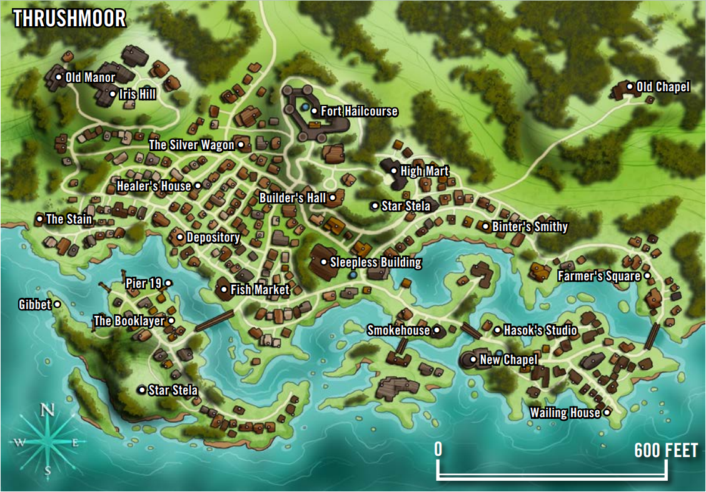

万古奇诡冒险之路从你的角色在疯人院中醒来开始，他们对自己是如何到达那里以及自己是谁毫无记忆。你们第一眼看到的疯人院就像是一幅噩梦般的混乱场景。事物显然并非表面所见，而血腥填满了阴森的石头大厅。如果希望生存下来，你们必须面对疯人院的种种挑战以及自己蒙蒙胧胧的记忆。

万古奇诡融入了许多Lovecraft（译注：《克苏鲁的呼唤》作者）式恐怖主题，呈现了一整个战役，让葛拉利昂的最新一批英雄们对抗来自时间和空间之外的令人发狂的威胁。在这个冒险之路中，你将遇到一些场景，如疯人院、阴森的老房子、陈旧的图书馆、被遗忘的沙漠城市，以及更奇异的地点。与此同时，万古奇诡仍然是一款基于Pathfinder规则的游戏。你的角色将随着等级的提升而获得力量，期望是他们能在看似无法逾越的恐怖面前生存并坚持下去。途中可能会有牺牲，但总体来说，万古奇诡并不意味着无情的GM可以在每次遭遇中随意杀死全体队员。和所有的冒险之路一样，万古奇诡的故事在有从头到尾的角色持续时展现得最好。他们可能在一切结束时带着伤痕（无论是精神上还是身体上），但总体而言，这个战役中的遭遇并非设计为不可逾越。

## 集结

这条冒险之路从玩家角色在疯人院的地下室中醒来并目睹一个可怕而血腥的场景开始。恢复意识后，玩家角色感觉仿佛刚从迷雾或梦境中走出，但对自己是谁以及如何到了当前的处境却难以记起。唯一剩下的记忆只是模糊的提示和直觉——几乎没有清晰的回忆。一个角色可能只记得自己在商人家庭中的早年生活的片段，而另一个角色可能只记得自己出生在欧帕拉，但其他的事情一无所知。记得多少或多或少由你自己决定。可以完全从一张白纸开始。然而，本次冒险之路假设玩家角色无法回忆起过去几年的任何事情。随着冒险的进行，角色们开始拼凑出发生在他们身上的事情，并在冒险之路的中途恢复全部记忆。

醒来后，你的角色感受到其他失忆者的存在，每个人都有着相同的疑虑，处在同一个牢房里。你的角色对这些人有一种模糊的亲切感，尽管原因不明。你的角色很可能意识到他们都被困在一个可怕的境地中，这些人可能决定了最终能逃脱还是在陷入混乱的疯人院中丧命。

醒来时，你的角色的记忆中还隐约有一种被奴役的感觉。这种感觉很模糊，但有一些回忆在角色脑海中浮现：他们曾被抓获，还带着一种恐惧感，仿佛在过去曾在压力下做过一些黑暗的事情。你的角色甚至可能认为这张白纸实际上是一种伪装的祝福。

在这样一个不稳的基础上开始冒险，需要团队相互信任。玩家需要放弃对角色过去的一些控制，以便在这条冒险之路上演绎出这种不确定的恐惧感。万古奇诡的玩家应该信任GM，并知道后者对他们角色的过去和未来有更多的信息，超出他们自己的设想。在一个优秀的GM手中，角色历史的这种缓慢揭示为战役增添了令人兴奋的元素，但这种叙事安排也可能让人感到被排除或对立。如果在这条冒险之路的任何时候你觉得角色的自主性被剥夺了，请与GM和团队讨论如何修改或改变故事以恢复一个舒适的对自己角色控制的程度。记住，不确定性可以很有趣，而在恐怖题材中，自愿放弃一些控制是一个关键元素。

由于万古奇诡充满了Lovecraft式的主题、神秘元素和超自然谜团，可能看起来让一个角色熟悉这些力量是个好主意。然而，扮演一个完全不了解古神秘学的人可能会更有趣。这取决于你和你的团队如何决定进行这次冒险之路，在万古奇诡中没有太多错误的玩法。玩家对寰宇恐怖或Lovecraft神话的兴趣比角色是否了解这些可怕而未知的事物更为重要。此外，玩家不需要成为Lovecraft传说的专家也能从这次战役中找到令人毛骨悚然的乐趣。

### 但我不想处于失忆状态！

并不是所有团队都想在记忆受损的情况下开始冒险。一些玩家可能不喜欢无法确定自己角色过去经历的设定。别担心！你仍然可以玩万古奇诡冒险之路。你和GM肯定需要做出一些改变，并会错过战役中的一个令人不安的元素，但记忆缺失并不是这条冒险之路的唯一驱动因素。

如果你在这次冒险中去掉失忆元素，就需要提供一个替代解释来说明角色是如何在疯人院陷入混乱时身陷其中的。也许你的角色是在探访朋友或亲人时进入了疯人院。也许你的角色是被朋友或家人送进来的（或者甚至是自愿进来的）。可能你的角色是疯人院的一名护工，或者是听说疯人院发生了怪事而决定前来调查的学者。这些都是在没有记忆丧失的情况下开始万古奇诡的可行选项，但请记住，这样做会改变战役前半部分的许多剧情事件。

也可以仅让部分玩家角色受失忆状态的影响。这需要未受影响的角色通过希望恢复同伴的心智或消除潜在的罪恶来推动故事的发展。总是有可能在这条冒险之路的早期遭遇中角色不幸牺牲，此时一个未受失忆状态影响的新角色会加入以替代倒下的角色。在这种情况下，玩家和GM应共同努力，寻找将新角色整合到团队中的最佳方式，具体取决于团队在战役中的位置，因为在万古奇诡中，许多利益关系比其他冒险之路更加个人化。

## 角色

你正在开始万古奇诡冒险之路，但应该扮演什么样的角色呢？考虑到角色记不住太多过去的事情，你该如何发展角色的背景故事？对抗来自时间与空间之外的寰宇恐怖，最好的选择是什么？以下的提示和建议可以帮助你创建完美适合应对即将到来的威胁和挑战的角色。这些想法并非详尽无遗，还有成千上万的可行角色概念可以在这个战役中表现出色。有关万古奇诡冒险之路中角色的更多讨论，请访问 paizo.com 的留言板。

在为万古奇诡冒险之路创建角色时，只需像为其他战役中的任何角色一样进行选择。选择你的种族、职业、专长、技能、背景和起始装备。你的GM会告诉你在战役开始时你身上有什么物品，其余的起始装备会在之后找回。

为了增加这条冒险之路中的恐怖元素，考虑创建一个明显有弱点或脆弱性的角色。这需要你和GM之间的信任，以确保后者不会滥用这种脆弱性，所以请提前与GM讨论你的概念。

本文件其余部分中的建议是与万古奇诡冒险之路的氛围和基调相符的好选择。

### 职业、变体和进阶职业

虽然许多适合任何冒险之路的选择在这个战役中也很适用，但有些职业选项特别适合在角色对抗难以形容的恐怖时使用。

Lovecraft式恐怖触及了未知的令人不安的方面以及凡人在浩瀚宇宙中的渺小。这种揭开现实层次以发现不可知真相的理念与《异能冒险》中介绍的神秘职业非常契合，但玩家也可能喜欢扮演一个对这些隐藏真相一无所知的人。也就是说，尽管异能施法者在主题上与这个冒险之路非常契合，但他们在这个战役中可能会遇到比平常更多的困难，因为有更大的可能性遇到恐惧效果和带有情感描述符的效果。创建异能施法者时，请牢记这一点。还应注意，任何擅长移除自身和其他角色负面状态的职业在这个战役中都会非常有用。

以下建议适用于在万古奇诡冒险之路中既有用又符合主题的原型。

- 进阶职业手册：伪魔术师（盗贼变体），退魔者（战斗祭司变体），神圣追猎者（游侠变体），演绎家（调查员变体），巫术引导者（女巫变体），特务（调查员变体），突变斗士（战士变体），附魂萨满（萨满变体），灵智侦探（先知变体），名侦探（调查员变体），述古者（萨满变体），除灵卫（萨满变体），灵媒师（调查员变体），黑市化学家（盗贼变体），观象使（萨满变体）
- 进阶玩家手册：书卷学者（吟游诗人变体），侦探（吟游诗人变体），般若僧（武僧变体），渗透者（游侠变体），调查员（盗贼变体），盲信者（野蛮人变体），城镇德鲁伊（德鲁伊变体），都市猎人（游侠变体）
- 惧怖冒险：邪教猎人（调查员变体），古神学者（法师变体），掘墓人（调查员变体），作祟收集者（秘学士变体），破巫之锤（审判者变体），怀言者（审判者变体），疯狂科学家（炼金术士变体），心魂卫士（圣武士变体），护符制造师（秘学士变体），巫师杀手（杀手变体）
- 异能冒险：秘传者（魔战士变体），走阴巫师（盗贼变体），灵异神探（调查员变体）
- 极限战斗：屠法者（审判者变体），猎巫人（审判者变体）
- 极限诡道：阴谋家（调查员变体），无踪客（催眠师变体），瞳术师（催眠师变体），信猎使（审判者变体），法医（调查员变体），瘾君子（调查员变体），怪盗（盗贼变体），寻秘者（审判者变体），赌徒（盗贼变体），暗探（盗贼变体），魔导师（侠客变体），狂热者（侠客变体）
- 极限魔法：外科医师（炼金术士变体），潜伏者（审判者变体），心智药师（炼金术士变体），圣律沿循者（圣武士变体，反腐化誓约），心灵学家（炼金术士变体），活体解剖师（炼金术士变体）
- 玩家伴侣-秘术选集：秘艺狂徒（盗贼变体）
- 玩家伴侣-街头英雄：都市之血（血脉狂怒者变体），城市猎人（猎人变体），都市歌者（歌者变体）
- 玩家伴侣-魔法战术工具箱：秘兽学者（调查员变体）
- 玩家伴侣-异能源始：哈罗牌研究者（奥能师变体），命运向导（唤魂师变体），心能狂怒者（血脉狂怒者变体），圣骸使（秘学士变体），超自然学家（德鲁伊变体），银王座先知（萨满变体）

如果你打算在以后考虑一个进阶职业，请考虑以下几个选项。由于你的角色将深入研究充满危险知识的书籍，核心规则手册中的博学士进阶职业可能是一个诱人的选择。如果你计划有一个宗教角色，请查看战役设定-内海诸神中的传音者、颂教者和卫道者进阶职业。如果你打算创造一个侦探角色，请考虑加入战役设定-进阶之路中的无眠侦探进阶职业。进阶之路中还有裂隙守卫进阶职业，非常适合致力于关闭危险传送门并与从不稳定边界涌现的恐怖生物作斗争的角色。

### 血脉、秘示域、庇护主和精神境界

几乎任何血统都是一个不错的选择，但希望与万古奇诡主题契合的术士应考虑以下血统：异怪血统、咒怨血统UM、命运血统、梦见血统APG、灵质血统OA、[Ghoul](https://aonprd.com/BloodlineDisplay.aspx?ItemName=Ghoul)MC、[Harrow](https://aonprd.com/BloodlineDisplay.aspx?ItemName=Harrow)HH、帝王血统ARG和心灵血统OA。

血脉狂怒者的选择较少，但最符合主题的血统包括异怪血脉ACG、奥秘血脉ARG和命运血脉ARG。

先知秘示域具有与万古奇诡主题最紧密联系的包括极限魔法中的暗幕秘示域和时间秘示域、进阶玩家手册中的知识秘示域以及玩家伴侣-街头英雄中的街巷秘示域。

有许多女巫庇护主非常适合万古奇诡的主题。玩家伴侣-纯善勇士有边界庇护主，非常适合与超凡邪恶作斗争的角色。异能冒险包括以太（ethereal）和心灵（mind）庇护主，这两者都是这场战役的合适选择。极限魔法包括狂乱、玄秘、征兆、精魂、繁星和时间庇护主，而惧怖冒险有阴谋（conspiracies）、衰败（decadence）和空间（space）庇护主。

以下来自异能冒险的精神境界在这场战役中是很合适的：憎恨、梦境、学识和迷幻药。

### 动物伙伴、魔宠和其他伙伴

影响玩家角色的失忆状态也延伸到任何动物伙伴、幻灵、魔宠、幻影或魂兽，它们同样无法回忆或传达任何最近的记忆。你与这样的生物的羁绊仍然坚固真实，即使你的角色可能不记得曾经有过它们作为伙伴！

尽管战役始于乌斯塔拉夫，你的角色可以来自任何地方，并可以选择任何GM允许的动物伙伴或魔宠选项。你的角色在到达乌斯塔拉夫之前可能早已养了一只异国宠物。

由于万古奇诡大部分发生在杂乱的庄园、神秘的图书馆和闹鬼的实验室内，不建议带坐骑的角色。同样，拥有特别大的动物伙伴的角色可能会在本战役中的某些（但绝不是全部）冒险地点中遇到难题。

### 宿敌和偏好地形

在万古奇诡中，坚实的宿敌选择包括异怪和类人生物（人类）。良好的次要选择包括异界生物（邪恶）和不死生物，有用的第三选择包括魔法兽和泥怪。这些并不能涵盖你的角色将面对的所有怪物和挑战，但它们在战役中经常作为对手出现。

这个冒险之路的一部分确实发生在城市环境中，因此城市作为偏好地形将非常有用。然而，角色也会经历大量的船旅以及后来的沙漠气候，因此水和沙漠作为偏好地形将成为有用的次要选择。

### 语言

在这个战役中，通用语是最广泛使用的语言，敌人和盟友都会使用它。你的角色将阅读的大部分文本也会是通用语。要与一些奇怪的敌人沟通，学习邪灵语可能会有所帮助，但掌握异怪和邪恶精类的语言技能对于低级角色来说不常见，因此需要充分的理由。

### 种族

由于你的角色理论上可以来自葛拉利昂的任何地方，核心规则手册中的所有种族都可以是这个战役的良好选择。如果你的角色来自战役开始的乌斯塔拉夫，那么你的角色很可能是人类，因为人类占据了该国大多数人口。乌斯塔拉夫的人类通常是瓦瑞西亚人或凯利德人。

核心规则手册中更罕见的种族也是可能的选择，但在选择时要小心，因为奇特的种族可能会分散恐怖氛围。替换儿可能是这个战役中富有风味的种族选择，但娜迦裔则可能会显得格格不入。

### 宗教

尽管宗教不是这个冒险之路的主要焦点，你的团队仍然需要一名牧师或类似角色来治疗沿途必然遭受的伤害。你可能会想扮演一个崇拜旧日支配者或外神的角色，但这并不是这个冒险之路的好选择。你将与崇拜这些邪恶存在的异教徒作战，对上古神话的了解会削弱未知恐怖的效果。在这个战役中，任何其他神祇都可以很好地发挥作用，但如果你希望选择一个与乌斯塔拉夫（冒险之路的起始地点）有关联的神祇作为你的守护神，考虑选择黛丝娜或法拉斯玛。

如果你崇拜一位神祇并从你的神祇那里获取力量，你会在醒来时理解到这种信仰，并感受到你与神的神圣联系。如果你崇拜一个善良的神祇，你可能会醒来时感到一种难以言表的愧疚或羞耻。尽管有这些持续的怀疑，你感到你的神祇已经给予你第二次机会来弥补任何过错。

### 技能和专长

能帮助角色探索可憎的知识、在奇怪而偏远的地方生存以及对抗难以言喻的恐怖的专长都是不错的选择，但没有特别突出的专长是你的角色在完成整个战役中绝对需要的。

万古奇诡冒险之路包含许多场景和事件，玩家角色必须运用智慧才能取得成功。科研在一些冒险中发挥了作用。虽然玩家不需要在科研机制上有专门的专长，但至少有一名队伍成员能够掌握多种知识技能是个很好的主意。其中最有用的技能包括知识（奥秘）、知识（地城）、知识（历史）、知识（贵族）、知识（位面）和知识（宗教）。

此外，整个战役中还有大量的社交互动，因此在团队中拥有擅长唬骗和交涉的玩家角色是个好主意。由于团队从疯人院开始，后来又深入神秘的图书馆、阴森的庄园和被遗忘的地方，拥有一名具备解除装置技能的队伍成员将在许多挑战中非常有用。

### 需要考虑的事项

除了之前关于角色创建的建议和战役开始时的解释外，在进行万古奇诡冒险之路时，还有一些事项需要考虑。

**信任你的GM**：由于这个冒险之路呈现出非标准的开局，这需要GM和玩家之间高度的信任才能顺利进行。你的角色在开始时对过去几乎没有控制，但在当前依然保持行动能力。你的角色在这个战役开始时最强烈的动机可能是生存和逃离疯人院，同时还要拼凑那些长达数年的失落记忆。随着时间推移，当你的角色揭开更多线索时，你作为玩家可能会因为你没有做出那些决定而感到不舒服或沮丧。接受这些事件，并深入探索你的角色，以探明发生的事情。为了充分享受故事，请把这些因来自外部控制和腐化而产生的挫折感宣泄给战役的对手，而不是向GM或其他玩家。GM不应轻视这种信任，与GM保持积极的沟通，讨论你的角色动机和你个人的界限，希望能保持大家达成统一并享受游戏。

**不要害怕谨慎行事**：在万古奇诡冒险之路中，你的角色可能会面对一些异常强大的敌人。记住，有时候撤退比继续战斗更明智，而且有时最好不要激怒潜在的威胁。记住这些注意事项将有助于保持你的角色生存，并增强战役中恐惧饱和的氛围。

**与小组交流**：万古奇诡冒险之路是一场寰宇恐怖战役。尽管寰宇恐怖不像斩杀恐怖或身体恐怖那样带有一些可怕和血腥的元素，但在这个故事中，你的角色仍然会遇到许多令人不安的元素。有些玩家可能不喜欢恐怖故事的所有要素。你应该事先知道参与恐怖冒险意味着什么，并为这些可能性做好准备。在故事中将会有令人不安的事件，以及让人不安的角色和生物。如果你有任何特殊敏感性，请确保与GM和其他玩家进行沟通，以便他们能意识到你的需求。有关恐怖主题冒险中同意的重要性的更多信息，请参阅惧怖冒险的第6章。

### 战役背景

这些背景将角色与万古奇诡冒险之路联系起来，在这条冒险之路上，队伍醒来时发现自己身处噩梦之中——被困在一所疯人院里，面对着一个令人恐惧的场景。尽管玩家角色不记得他们的过去，这些背景提供了一种他们是谁或可能曾经是谁的感觉。虽然这些只是模糊的感觉和性格元素，但它们可以帮助角色更好地融入万古奇诡冒险。

**愧疚驱使**：你在经历磨难后醒来，心中留有一种挥之不去的感觉，仿佛曾参与了某些超出道德底线的事情。无论你曾一度被腐化或被迫进行某些遗忘的行为，这种愧疚驱使你与世界上那些侵害善良的力量作斗争。你将当前的处境视为一个赎罪的机会，以消除这种令人不安的情绪。  
你在对抗由邪恶生物施放的任何法术或类法术能力时，在豁免检定上获得+1背景加值。此外，每日一次以一个迅捷动作，在接下来一轮中，你可以在对抗邪恶生物的攻击检定中加入你的魅力加值，且在伤害检定中增加等同于角色等级的数值。你必须是善良阵营才能选择此背景。

**坚忍不拔**：即使在醒来时听到自己的脉搏声冲到耳边，你仍然感到异常镇定。你可以认清自己所处的恐怖环境，但你拒绝让恐惧控制你。你认为这不值得过分担忧。你知道，当面对难以言喻的力量时，保持冷静能让你活下来。  
你在对抗带有恐惧或情绪描述符的法术或效果时，在豁免检定上获得+2背景加值。此外，由于你的令人敬畏的气场，你在威吓检定中获得+1背景加值，因为人们不知道对你会有什么期待。

**怪异之敌**：在经历了一场可怕的噩梦后，你醒来时感到胆气倍增。这些经历使你对那些奇异的外星生物产生了坚韧的抵抗力，而不是被它们吓倒。你知道自己曾是怪异环境和可憎力量的牺牲品，但你拒绝屈服于无助感。相反，你发誓要反击那些导致你当前处境的人或物。你不会让噩梦中的生物对你产生恐惧。你将向它们发起反击。  
你在对抗异怪的特异能力、类法术能力和超自然能力时，豁免检定获得+1背景加值。此外，当你处于困惑状态并在某轮中掷骰确定行为时，结果减去10。

**精神互换**：你醒来时感到一种奇怪的感觉，这种感觉超出了记忆丧失的恐怖体验。虽然这些经历的详细记忆——如同其他许多记忆一样——已从你的脑海中抹去，但在某个时刻，你的思维曾与异时空生物伊斯之伟大种族的思维互换。你不记得自己在伊斯之伟大种族的奇特城市中以异体漫游的详细经历——甚至担心这是否是一种奇怪的幻觉——但偶尔会因这种经历而闪现出一些见解。你知道在调查当前情况时可以依赖这些外星的闪回，因为它能让你在一个混乱的世界中获得更大的视角。  
每日一次，你可以重骰一次刚刚失败的知识检定。此外，你尝试未受训的知识检定时DC最高为20而不是10。

**逻辑思维**：当你醒来时，记忆一片模糊，你开始仔细地整理思绪，以确定你为何会陷入这种状况以及你可能身处何地。这种整理让你感到安心，你深知自己一直依靠有序的思维和务实的方法来面对挑战。你利用这种专注和理性来应对当前的困境。  
选择三个知识技能。你在这些类型的知识检定和专注检定中获得+1背景加值。此外，选择一个知识技能。在科研时，当确定你掷骰以减少图书馆的知识点（kp）时，你被视为具有该知识技能的技能专攻专长。详见极限诡道的科研规则。

**好斗**：你在疯人院醒来时肌肉酸痛、拳头沾血，仿佛你刚经历了一场战斗。你甚至模糊地感觉到你赢了。你无法解释这种感觉，但你知道自己一直很容易被激怒，当被逼到绝境时你的第一反应是猛烈反击。被困在疯人院让你感到紧张，你不仅想弄清楚自己发生了什么事，还想找到那个将你置于此地的人，并让他们付出代价。  
当你被两个或更多敌人威胁时，你在攻击检定中获得+1背景加值。此外，每日一次，你可以作为一个直觉动作获得以下效果之一：你可以在一轮内将近战攻击的触及距离增加5尺，或者你可以在一轮内将你的武器视为比实际大一个体型来确定伤害。

**仪式感**：你醒来时感到一种使命感和魔力的微弱波动。虽然记不起过去让你感到不安，但你有预感，如果你和你的同伴按照正确的步骤和顺序行事，答案将会揭晓，你也将摆脱当前的处境。你觉得自己过去总是依靠周密的计划和经过时间检验的证据，但一种挥之不去的感觉告诉你，你最近用这些技能做了一些不太友善的事情。  
选择一个0环法术。你可以每日一次将此法术作为类法术能力施放，施法者等级等于你的角色等级。类法术能力的豁免DC基于魅力。此外，在进行神秘仪式时，你在所有技能检定中获得+2背景加值。

**敏感心灵**：你在疯人院醒来时异常敏锐地感知到附近潜伏的危险。虽然记忆模糊不清，但周围的一切都显得生动且清晰。你隐约觉得自己一直很敏锐，即使在短暂的会面中也能看透一个人。这种敏感有时会让你不堪重负，尤其是在当前的情况下。  
你在估价、察觉和察言观色检定中获得+1背景加值，并且其中一个（由你选择）是你的本职技能。此外，每周一次，你可以使用感灵神秘技能解放，即使你无法施放异能法术或没有异能敏感专长。

**真正的奉献**：你从最近的磨难中醒来时感到一种羞耻，仿佛你曾严重违背了自己的道德和信仰。然而，你也感到了一丝宽慰，仿佛你的神灵给了你第二次机会。你不仅有动力弄清楚发生了什么事，还想与难以言喻的邪恶力量作斗争。如果在调查过程中，你发现自己曾参与了与你的信仰或阵营相悖的可疑活动，由于你焕发的正义信念，这一事件不再影响你在神灵眼中的地位。  
每日一次，当施放神术时，你可以尝试在不消耗每日法术位或已准备法术的情况下施放该法术。该法术不被消耗的概率为20%。此外，选择你拥有的一个领域或裁决域。你可以每日额外使用一次该领域或裁决域的第一个能力。你必须是善良阵营并且具有可以施放神术的职业才能选择此背景。

**神经质**：在疯人院醒来时，你的第一反应不是对自己为何记不清任何事情感到困惑，而是突然产生寻找安全感的冲动。你觉得周围的一切，除了你的同伴，都可能对你构成威胁，你总是准备好反应。你很难静止不动，总是在观察周围的环境。也许你是偏执狂，或者只是想象力过于丰富，但无论是什么原因，你知道保持这些感觉敏锐会帮助你活下来。  
你在先攻检定中获得+2背景加值，在反射豁免检定中获得+1背景加值。

## 关于乌斯塔拉夫

万古奇诡冒险之路的故事情节从玩家角色在乌斯塔拉夫的疯人院中醒来开始，在第二本冒险中前往邻近小镇，随后向南前行，通过多个地点，试图揭开导致他们被送进疯人院的事件，并争取机会对要为此负责的人进行报复。以下是关于乌斯塔拉夫的一些一般信息。如果你想了解更多，请参阅战役设定-Rule of Fear。

乌斯塔拉夫不朽公国位于恩卡尔坦湖的北岸，是一个被北方野蛮人包围的文明堡垒。严酷的地貌和充满悲剧的历史让这里的居民充满怀疑、宗教虔诚和迷信。乌斯塔拉夫是由若干松散联系的郡组成的，这些郡由争权夺利的贵族统治，是一个昔日辉煌的残影。在遭受了数个世纪的奴役，受到默语暴君的不死军队的统治后，乌斯塔拉夫变得凄惨不堪。

尽管国家的上层阶级努力与那些在默语暴君被击败后抛弃他们自谋生路的国家竞争，但普通的乌斯塔拉夫公民面临的现实要残酷得多。数百年的压迫和困扰乡村的残余恐怖使乌斯塔拉夫人民对魔法、宗教、外国人，甚至对自己的同胞都充满了怀疑。除了他们古怪和封闭的特点外，乌斯塔拉夫人通常还持有一种悲观的世界观。他们认为生活充满苦难，在他们的历史中没有任何迹象表明会有更好的生活。尽管身体和心理上承受着巨大压力，乌斯塔拉夫人却培养出极其坚韧的性格：他们坚信无论情况多么糟糕，历史证明情况总是可以更糟。

虽然乌斯塔拉夫的乡村农民几乎没有什么可提供的，但其众多大都市地区的居民情况稍好一些，这些地区的文化和学术中心吸引着来自内海地区的贸易和旅行者。首都卡利法斯位于恩卡尔坦湖畔，其被雾气笼罩的街道上坐落着一些国家最负盛名的贸易和学术机构。在北部，卡尔考城拥有繁荣的音乐、戏剧和其他美术文化，其奢华的建筑甚至可以与最异国情调的塔尔多宫殿媲美。与此同时，乌斯塔拉夫的西北各郡已经脱离了贵族统治，成立了自己的地方民主政府，称为帕拉提内斯，为乌斯塔拉夫省的贫困人民带来了一线希望。

### 画眉沼镇

虽然角色们要到第二本冒险才会真正到达画眉沼镇，但他们最初所在的疯人院是建在荆棘石岛上的。这个岛位于丹弗河中，不远处就是画眉沼镇。

这个定居点最初由凯利德流浪者建立，近七个世纪以来，丹弗河口一直存在某种形式的定居点。早期的定居者在这里找到了丰富的洁净水源和充足的渔业资源，尽管如此，许多人认为这个地区受到了诅咒。尽管人们拥有所有生存所需的资源，但每个阴影背后似乎都潜藏着危险，他们驯服土地的努力总是会出问题。

画眉沼镇是乌斯塔拉夫维塞克斯郡的权力中心，也是乌斯塔拉夫统治家族洛尔斯家的住所。尽管镇上有着一层体面的外表，但其暗藏着阴险的一面。哈瑟顿·洛尔斯四世伯爵采取了基本不干涉的统治方式，将郡的大部分管理工作交给选举或任命的镇长。就画眉沼镇而言，这位官员是裁判官提勒斯·帕杰特。伯爵的隐居倾向很少影响画眉沼镇的日常活动，因为这位贵族大部分时间都躲在他的庄园爱瑞斯山中，专注于研究未知主题的神秘典籍和古老魔法书。

画眉沼镇主要是一个渔镇，阿瓦隆湾的温和气候和肥沃水域为渔民们提供了全年丰收的渔业活动。只有在湖面结冰的几天里，船只才会停止活动，即便如此，港口宁静的入口也是冰上钓鱼的理想场所。